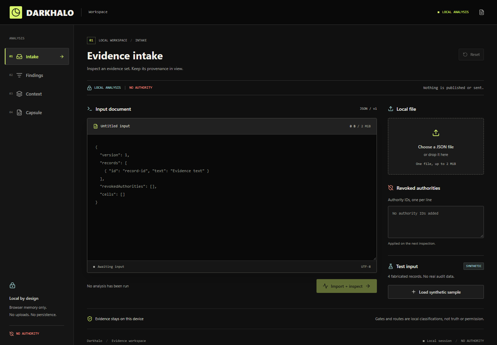

# Brandon Ducar | DreamNet

**AI should do useful work, remember why, and show its evidence.**

I'm Brandon Ducar. I build DreamNet tools for persistent context, bounded AI work,
and results people can inspect. Start with a working demo, a small reproducible
example, or a contribution to one public project.

[Try BREAKSHIFT](https://breakshift-maintenance-bay.dreamnet-intel.workers.dev/) |
[Explore the projects](#project-directory) |
[Contribute](CONTRIBUTING.md)

## Featured: BREAKSHIFT

**Your AI says "fixed." BREAKSHIFT says: prove it.**

Inspect a component, challenge a repair plan, and replay the evidence in a
simulated robotic workcell. Change the assumptions and stale passes are withdrawn.
Simulation is not physical repair clearance.

[Try the open demo](https://breakshift-maintenance-bay.dreamnet-intel.workers.dev/) |
[Watch the corrected v2.2 demo](https://www.youtube.com/watch?v=o6qEsiYmQdM) |
[Inspect the source](https://github.com/BrandonDucar/breakshift)

The workbench opens without a login. Fresh paid model analysis remains
operator-restricted; retained model outputs are labeled as recorded.

## Accepted Upstream: Hermes Verify

[Hermes Verify](https://github.com/BrandonDucar/hermes-verify) adds unverified-output
labels, tool-risk checks, and inspectable result receipts for Hermes Agent.
Its **0.5.0 community catalog contribution was merged** into Nous Research
Hermes Agent on November 12, 2026:
[accepted catalog PR #153179](https://github.com/NousResearch/hermes-agent/pull/153179).

[Inspect the catalog-pinned 0.5.0 source](https://github.com/BrandonDucar/hermes-verify/tree/22cd13c6ae7e07296a333b31c828db44455098ef) |
[Watch the 78-second synthetic demo](https://x.com/GhostmintO71217/status/2120374839672439108)

Catalog acceptance is separate from installation or runtime adoption. The demo
uses synthetic inputs; labels and heuristic checks do not establish factual truth,
action completion, or a security guarantee.

## Project Directory

Choose the smallest tool that fits your problem. Each project has its own setup,
license, data boundaries, and release lifecycle.

| I need to... | Start here | What to expect |
| --- | --- | --- |
| Challenge a repair plan | [BREAKSHIFT demo](https://breakshift-maintenance-bay.dreamnet-intel.workers.dev/) / [source](https://github.com/BrandonDucar/breakshift) | Simulated workcell and evidence replay; no physical repair clearance |
| Inspect agent claims and tool returns | [Hermes Verify 0.5.0](https://github.com/BrandonDucar/hermes-verify/tree/22cd13c6ae7e07296a333b31c828db44455098ef) | Output labels, heuristic tool-risk checks, local receipts |
| Preserve and resume bounded work | [DreamLoops](https://github.com/BrandonDucar/dreamloops) | Versioned loops, capability Capsules, execution records |
| Inspect a repository before running it | [Cerberus](https://github.com/BrandonDucar/dreamnet-cerberus) | Offline static findings tied to source digests; no safety guarantee |
| Review agent-run context | [Darkhalo](https://darkhalo.dreamnet-intel.workers.dev) | Local-first inspection and review capsules |
| Prepare source-linked knowledge | [Memory Weaver](https://github.com/BrandonDucar/memory-weaver) | Portable context with provenance |
| Hand off context or build evidence | [Warper Keeper](https://warper-keeper.dreamnet.ink) / [Proof Drop](https://proof-drop-zabal.pages.dev) | Context bundles and local evidence-file hashing with exported receipts |

[Browse the full public directory](https://brandonducar.github.io/BrandonDucar/) |
[Ecosystem map](ECOSYSTEM.md) | [DreamNet](https://dreamnet.ink)

**Independent products. Optional connections. Private operations.** You do not
need DreamNet's private monorepo to use a public project. Integrations use explicit
interfaces, not shared credentials. The larger connected-system design remains
an engineering goal; these links do not establish a verified active fleet.

*Darkhalo's actual public interface. Its built-in sample is explicitly synthetic;
the screenshot is not a receipt for real-world work.*

## Start With A Problem

**Try one reproducible result:** [Inspect a repository and keep its evidence](REPRODUCIBLE_DEMO.md).
Cerberus inspection feeds Memory Weaver's source-linked context export. Runs
locally without dependencies or API keys; includes tampering, changed-input and
blocked-install cases. Synthetic inputs, actual execution, unsigned receipts.

## Integrated Outside DreamNet

The independently operated [ZOL](https://github.com/bettercallzaal/zol) project
merged a [DreamLoops persistent-agent integration](https://github.com/bettercallzaal/zol/pull/19)
and a [Bonfire memory adapter](https://github.com/bettercallzaal/zol/pull/16).
The pull requests show the contributions. They are not a claim about ZOL's
current runtime, an endorsement, or DreamNet ownership.

## Explore Further

- [Public Core](https://github.com/BrandonDucar/Dreamnet): shared agent contracts.
- [ToolGym](https://github.com/BrandonDucar/toolgym): agent workouts; practice is not independent qualification.
- [LaunchCast](https://github.com/BrandonDucar/launchcast): repository-to-storyboard and local video rendering; uploads are not implemented.
- [Dreamnetiopi](https://github.com/BrandonDucar/dreamnetopi-hackday): merchant-operations rehearsal, not production telemetry.
- [Public project directory](https://brandonducar.github.io/BrandonDucar/#projects): a dated catalog of apps, libraries, research, prototypes, and attributed forks, not a live inventory.

## Build With Us

| What brings you here? | Next step |
| --- | --- |
| I need help or found a bug | [Open a product help request](https://github.com/BrandonDucar/BrandonDucar/issues/new?template=01-product-help.yml) |
| I want to connect two tools | [Propose an integration](https://github.com/BrandonDucar/BrandonDucar/issues/new?template=02-integration.yml) |
| A link, screenshot or description is wrong | [Report a directory correction](https://github.com/BrandonDucar/BrandonDucar/issues/new?template=03-directory.yml) |
| I have a broader question | [Join the public-core discussion](https://github.com/BrandonDucar/Dreamnet/discussions) |
| I want to contribute code or docs | [Read the contribution guide](CONTRIBUTING.md) |

Not sure which repository owns a problem? Start here with the product name and a
small, non-sensitive example. We can identify the right repository before you
invest in a patch. These are public conversations, not private support tickets.

[Support and privacy boundaries](SUPPORT.md)

DreamNet is early. Each repo has its own implementation boundaries and license.
A receipt is not proof that every claim inside it is true, and a capability is
not permission to act. Private credentials, customer data, and operating context
do not belong in public examples.

Public overview revision: **1.1.0**, November 12, 2026. This is a documentation
revision, not a synchronized release of every linked product.
